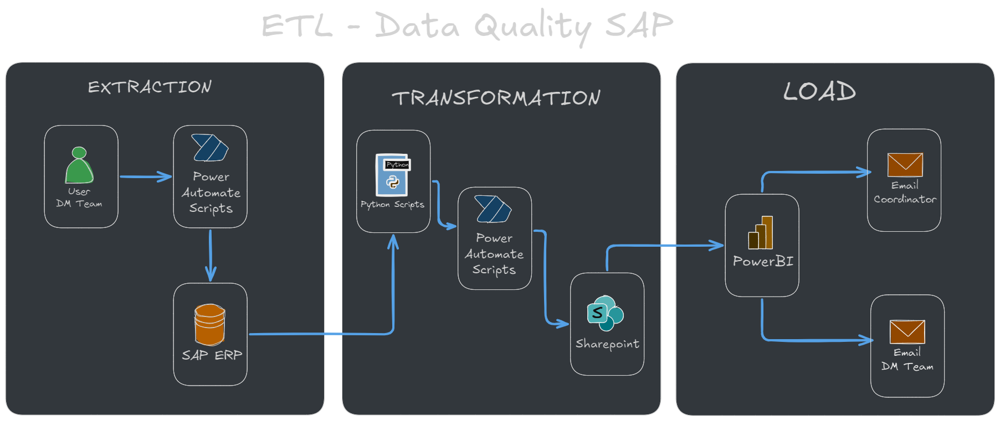

Partes del flujo de data para generar indicadores de calidad:

librerias requeridas:
et-xmlfile==1.1.0
numpy==2.1.0
openpyxl==3.1.5
pandas==2.2.2
psutil==6.0.0
python-dateutil==2.9.0.post0
pytz==2024.1
six==1.16.0
tzdata==2024.1

logica del proceso:

1- se extrae la informacion de SAP con el script: runVbs.vbs
2- Mediante scripts se convierte la informacion a CSV para ser procesada en ruta data/temp
3- se cargan los modelos en un dataframe mediante pandas
4- se aplican reglas de negocio descritas a continuacion.

se debede validar que
tratamiento empresa no tenga clase de impuestos pn OK
tratamiento empresa no tenga tipo nif <> 31 OK
tratamiento empresa no tenga medios magneticos (nombre3 y nombre4) OK
nif 5 no este vacio OK
los numeros de telefono no tengan guiones (-) OK
las direcciones no tengan caracteres especiales (# - grados N`) OK
check de persona fisica = a nif 13 & clase imp 13 OK

5- Se genera informe y graficos con las anomalias encontradas
6- Se envia el informe al coordinador del area con los indicadores generados
7- Se envian los errores al equipo de DM para realizar las correcciones en la data

